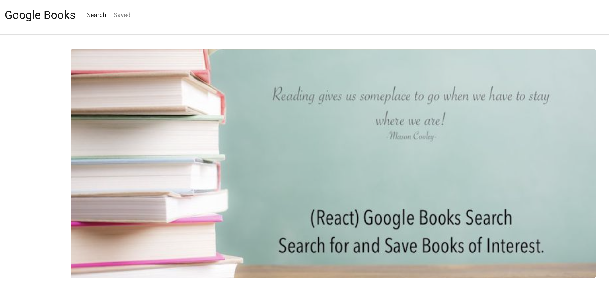
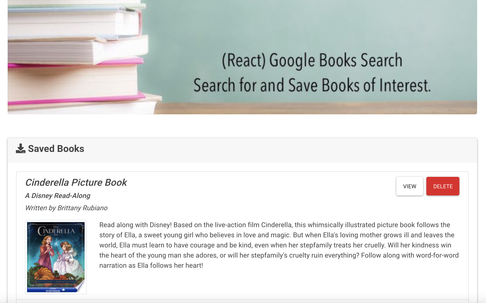

# My Book Google

### Overview

In this activity, you'll create a new React-based Google Books Search app. This assignment requires you to create React components, work with helper/util functions, and utilize React lifecycle methods to query and display books based on user searches. You'll also use Node, Express and MongoDB so that users can save books to review or purchase later.

### Installation

* npx create-react-app
* npm install express
* MongoDB Atlas -- npm install mongoose 
* API -- npm install axios

### Run local
npm start

### Heroku Deploy
https://my-book-google.herokuapp.com/
 
### Runs the app in the development mode.
http://localhost:3000

### Images of application
Home
List of books 
Saved page 

### Technology
React with JSX
MongoDB
Google Api

### Question
For more questions about Team Profile Generator you can go to my Github page at the follow link:

### Question

For more questions about Team Profile Generator you can go to my Github page at the follow link:

  - [GitHub Profile](https://github.com/adriana-carmo)
  - [GitHub My Book Google Repo](https://github.com/adriana-carmo/My_book_google) 

For additional questions please reach out to my e-mail at : dri.abedala@gmail.com